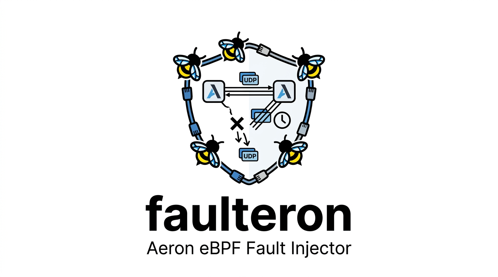

[](LICENSE)

Network fault injection for Aeron deployments, in eBPF. A pair of tc programs drop, duplicate and delay UDP on one
interface by peer address, port, Aeron frame type, retransmission and SBE message. A test can cut one link between
two members and leave every other, cut a member off from its peers while its clients stay connected, take away
one half of Aeron's loss repair, make a link slow, reordering and duplicating, or silence one member's votes and
nothing else. Process kills and pauses cannot produce any of these. The tests here drive
[seqeron](https://github.com/FredrikJDahlberg/seqeron), an Aeron Cluster sequencer.

Linux only, kernel 5.18 or later, IPv4 only. It runs in a privileged container that shares the target
container's network namespace; on macOS, use the Docker VM (Colima or Docker Desktop). On a host without
containers, run `bin/faulteron` as root with `FAULTERON_DEV` set to the interface and `FAULTERON_OBJ` to the
compiled program. Traffic over `aeron:ipc` never reaches an interface, so no rule can touch it.

## Build

```bash
docker build -t faulteron:local .
```

## Use

```bash
F() { docker run --rm --privileged --network "container:$1" faulteron:local faulteron "${@:2}"; }
F node-1 attach                                   # attach at tc ingress and egress of eth0, fq as root qdisc
F node-1 block 9303 9314                          # drop all UDP to or from these ports
F node-1 block --type nak 9324                    # drop only Aeron NAKs
F node-1 rule --type data --loss 5 9324           # drop 5% of Aeron DATA
F node-1 rule --delay 20 --jitter 30 --duplicate 10 9313
F node-1 block --type retransmit 9324             # drop only retransmitted DATA
F node-1 block --template request-vote 9303       # drop only RequestVote messages
F node-1 block --peer node-2                      # drop all UDP to and from node-2, on any port
F node-1 rule --schema 101 --delay 50 9301        # delay archive control messages
F node-1 stats                                    # <port> <type> then settings and counters as name=value
F node-1 remove --type nak 9324
F node-1 detach                                   # heals everything
```

A rule matches UDP to or from each port given, or any port if none is, narrowed by a selector:

- `--peer`: the far end of the packet, its destination going out and its source coming in, by IPv4 address or by a
  host name resolved in the target's network namespace. Multi-host Aeron Cluster deployments use the same ports
  on every member, so a peer is what singles one out.
- `--type`: an Aeron frame type (`data`, `nak`, `sm`, `err`, `setup`, `rttm`, `res` or a number), `retransmit`,
  or `any` (the default), which also matches traffic that is not Aeron. `retransmit` is DATA that starts below
  what its flow has already sent; a flow is a publication's session and stream plus the destination address and
  port, since a multi-destination publication sends each destination its own copy.
- `--schema`: the SBE schema id of a DATA frame's message, such as Aeron Cluster's 111 or Aeron Archive's 101.
  It implies `--type data`.
- `--template`: the SBE template id within `--schema`, which defaults to Aeron Cluster's. Cluster messages also
  go by name: `canvass-position`, `request-vote`, `vote`, `new-leadership-term`, `append-position`,
  `commit-position`, `catchup-position`, `stop-catchup`, `termination-position`, `termination-ack`,
  `backup-query`, `backup-response`, `heartbeat-request`, `heartbeat-response`, `standby-snapshot` (ids as of
  Aeron 1.53.2). It implies `--type data`.

Schema and template are read from a message's first fragment only; a later fragment matches as plain DATA. A packet goes
to the most specific rule that matches it: one naming its peer before one that does not, then its destination port, its
source port, any port, and within each `retransmit`, then type, schema and template, type and schema, type, `any`. A
packet no rule matches costs up to 30 hash lookups. A rule drops `--loss` percent of what it matches, sends
`--duplicate` percent of the rest twice, and holds it `--delay` plus up to `--jitter` milliseconds. Jitter longer than
the gap between packets reorders them.

- **Delay applies only to packets leaving the interface,** because the `fq` qdisc holds them until the departure
  time the program stamps. To delay what reaches a member, impair the sender.
- **Aeron batches DATA frames,** so a DATA rule acts on whole datagrams.
- **The attachment outlives each `docker run`.** A container restart gets a new network namespace and drops it.

## Tests

`test/faulteron-rules.sh` needs docker alone and takes about ten seconds. It sends hand-made Aeron frames and
timestamped lines between two throwaway containers, with one rule of every kind installed, and checks which rule
each packet went to, what the rules counted, what the receiver got (delay, duplicates both ways, reordering), that
the CLI refuses bad input without changing any rule, and that `remove` and `detach` undo exactly what they should.

The `seqeron-*` tests run seqeron's three-node docker cluster, in which every member has its own ports, and need its
operator distribution (`./gradlew operatorDist`) in `SEQERON_DIR`, which defaults to a checkout beside this one,
`../seqeron`. `test/lib.sh` is what they share.

- `test/seqeron-partition-leader.sh` cuts the leader off from its peers while a `ClusterProbe confirm` producer
  streams through it, then heals it. It asserts that packets were dropped, that the majority elected a new
  leader, that the old leader rejoined as a follower, and that the PendingSends producer saw every frame exactly
  once.
- `test/seqeron-asymmetric-partition.sh` cuts only the link between the leader and one follower
  (`--peer`); the other follower still reaches both. It asserts that the cut-off follower, which stands for
  election, does not depose the leader, that a producer on the other follower stays exact, and that the
  follower catches up once healed.
- `test/seqeron-unrepaired-follower.sh` drops 5% of one follower's log DATA and one half of its repair: its NAKs
  (`REPAIR=nak`, the default) or the leader's retransmissions to it (`REPAIR=retransmit`). The follower falls
  behind with no election called. The test asserts that a ping through that follower's tap passes before the
  fault, times out under it and passes again after the heal, and that a producer on the other follower stays
  exact throughout.
- `test/seqeron-jittery-leader.sh` delays the leader's cluster and ingress traffic by 20–50 ms and duplicates 10%
  of it, under the 200 ms leader heartbeat timeout. It asserts that no election runs, that every member's tap
  answers a ping, and that a producer on a follower stays exact. `DELAY_MS=250 JITTER_MS=0` takes the delay past
  the timeout; that run is expected to fail.
- `test/seqeron-throttled-leader.sh` caps the leader's container at 0.05 CPUs while it runs (`docker update
  --cpus`, through `throttle` in `test/lib.sh`), so it is alive and connected but too slow to lead. It asserts that
  the cluster replaces it, that a producer on a follower stays exact, and that the old leader rejoins and catches up
  once its CPU is back. This fault is the harness's, not faulteron's: `aeron:ipc` traffic never reaches an
  interface, and a stall is the only fault it has, which starving the node of CPU produces. `CPUS=0.5` is a cap
  the leader keeps up under; that run is expected to fail.
- `test/seqeron-mute-voter.sh` drops one follower's RequestVote and Vote messages and nothing else, then kills
  the leader. It asserts that the fault is invisible until then, that the two survivors elect no leader while it
  holds, that they elect one as soon as it heals, that the killed member rejoins, and that a producer on the
  muted follower stays exact. The hold stays under the 5 s new-leader timeout of seqeron's `ClusterStreamSender`:
  past it, the producer's session closes and nothing reopens it.

## License

Copyright 2026 Fredrik Dahlberg

Licensed under the Apache License, Version 2.0 (the "License"); you may not use this file except in compliance with
the License. You may obtain a copy of the License at

https://www.apache.org/licenses/LICENSE-2.0

Unless required by applicable law or agreed to in writing, software distributed under the License is distributed on
an "AS IS" BASIS, WITHOUT WARRANTIES OR CONDITIONS OF ANY KIND, either express or implied. See the License for the
specific language governing permissions and limitations under the License.

[NOTICE](NOTICE) records the copyright, and §4(d) of the License obliges anyone redistributing faulteron to carry it
forward.
